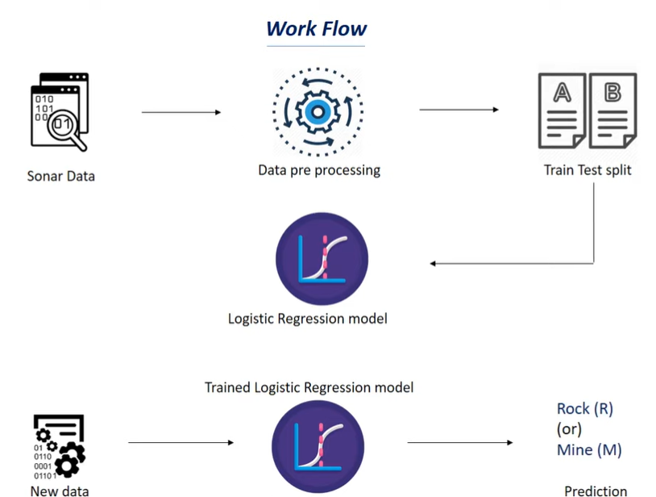

# Harmony in the Depths: A SONAR Symphony of Rock vs. Mine Prediction

## Project Overview
Welcome to "Harmony in the Depths," a project where we explore the world of underwater SONAR data to distinguish between rocks and mines. This project utilizes machine learning, specifically Logistic Regression, to build a predictive model that can classify underwater objects based on SONAR signals.

## Project Workflow



## Project Structure

### 1. Importing Dependencies
This section covers the essential libraries used in the project, such as NumPy, Pandas, and scikit-learn for machine learning.

### 2. Data Collection and Preprocessing
Here, we load the SONAR dataset into a Pandas DataFrame, explore its structure, and perform necessary preprocessing steps. The dataset consists of 208 samples, each with 60 features and a target column indicating whether the object is a Rock (R) or Mine (M).

### 3. Exploratory Data Analysis (EDA)
We conduct exploratory data analysis, including statistical measures and class distribution analysis, to gain insights into the dataset.

### 4. Data Splitting
The dataset is split into training and testing sets, ensuring that the distribution of classes is preserved using stratified sampling. 90% of the data is used for training the model, and 10% is reserved for testing.

### 5. Model Training (Logistic Regression)
A Logistic Regression model is chosen for its simplicity and effectiveness in binary classification tasks. The model is trained on the training dataset.

### 6. Model Evaluation
The trained model's performance is evaluated on both the training and testing datasets using accuracy as the metric. The goal is to ensure the model generalizes well to new, unseen data.

### 7. Making Predictions
The final section demonstrates how to use the trained model to make predictions. An example input is provided, and the model predicts whether the object is a Rock or a Mine.

## Results
The Logistic Regression model achieves an accuracy of approximately 83.42% on the training data and 76.19% on the test data, indicating decent performance. The predictive system successfully classifies new instances based on SONAR signals.

## How to Use
1. **Clone the Repository:** 
   ```bash
   git clone https://github.com/GaurabKundu1/Harmony-in-the-Depths-A-SONAR-Symphony-of-Rock-vs.-Mine-Prediction.git
   ```

2. **Install Dependencies:**
   ```bash
   pip install -r requirements.txt
   ```

3. **Run the Jupyter Notebook:**
   ```bash
   jupyter notebook Rock Vs Mine Prediction.ipynb
   ```

4. **Explore and Experiment:**
   - Dive into the notebook to understand the data, model training, and evaluation.
   - Modify parameters, try different algorithms, or experiment with feature engineering for further improvement.

## Conclusion
"Harmony in the Depths" showcases the application of machine learning in distinguishing underwater objects based on SONAR signals. The project provides a solid foundation for understanding the dataset, training a classification model, and making predictions on new data.

Feel free to contribute, provide feedback, or extend the project in your own creative ways. Happy coding!
